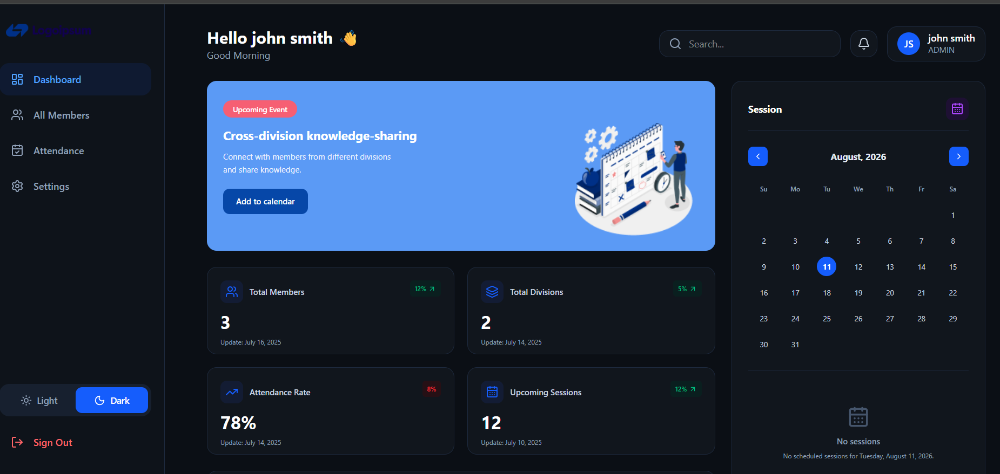
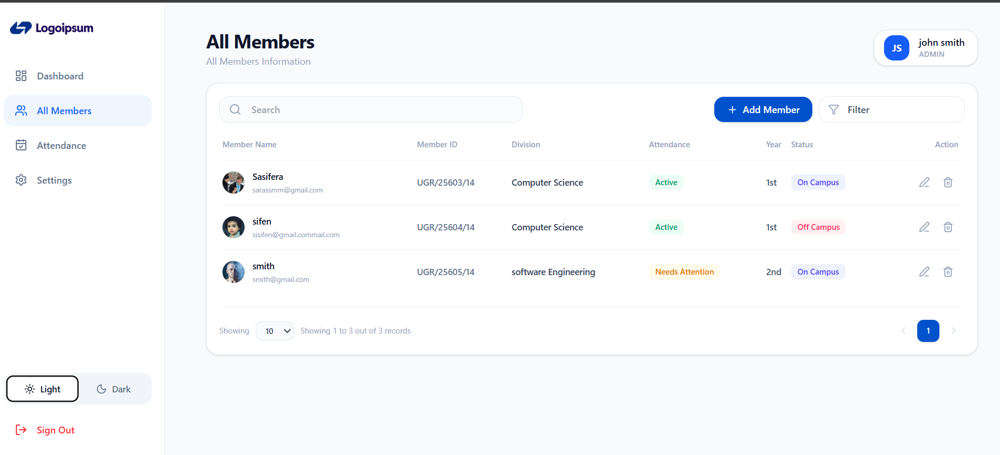
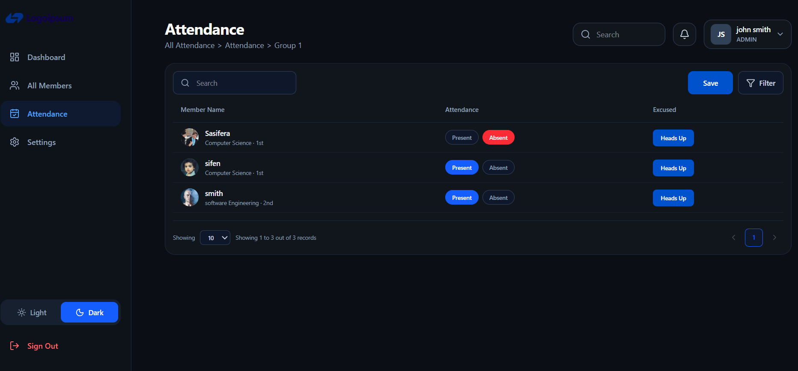
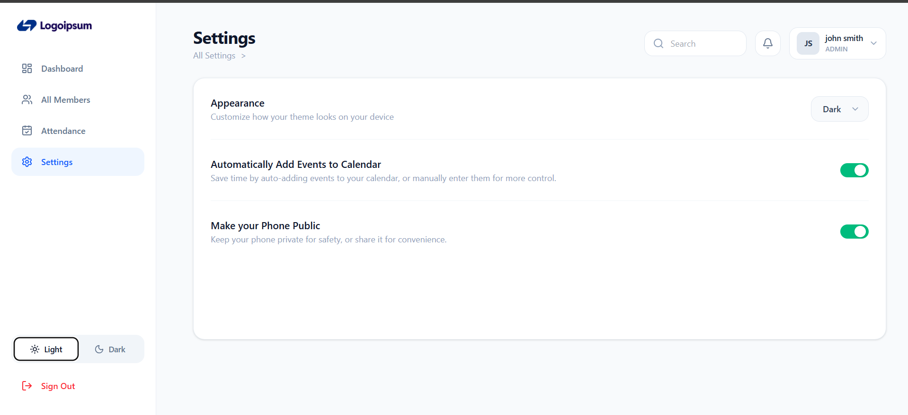

# Management System

A full-stack **Role-Based Management System** built with React, Node.js, Express, and MongoDB.

The system provides secure authentication, role-based access control, member management, attendance tracking, dashboard statistics, and customizable light/dark themes.

---

## Features

### Authentication

- User registration and login
- Secure password hashing with bcrypt
- JWT-based authentication
- Protected routes
- Automatic authentication state management
- Logout functionality
- Role-based authorization

### Member Management

- Add new members
- View all members
- View individual member details
- Update member information
- Delete members
- Member information includes:
  - Full name
  - Email
  - Phone number
  - Division
  - Year

### Attendance Management

- Mark members as:
  - Present
  - Absent

- Prevent duplicate attendance records for the same member/date
- View attendance records
- Update attendance records
- Display member information using MongoDB population
- Record who marked the attendance
- Attendance date validation

### Dashboard

The dashboard provides an overview of the system, including:

- Total members
- Upcoming events
- Division statistics
- Attendance rate
- Other management statistics

### Role-Based Access Control

The system supports different user roles:

- **Admin**
- **Supervisor**
- **User**

Permissions are controlled on both the frontend and backend.

Example:

| Feature         | Admin | Supervisor | User |
| --------------- | :---: | :--------: | :--: |
| Dashboard       |  ✅   |     ✅     |  ✅  |
| View Members    |  ✅   |     ✅     |  ✅  |
| Add Members     |  ✅   |     ✅     |  ❌  |
| Edit Members    |  ✅   |     ✅     |  ❌  |
| Delete Members  |  ✅   |     ❌     |  ❌  |
| View Attendance |  ✅   |     ✅     |  ❌  |
| Mark Attendance |  ✅   |     ✅     |  ❌  |
| Settings        |  ✅   |     ✅     |  ❌  |

> The exact permissions can be modified according to the application's requirements.

### User Interface

- Responsive dashboard layout
- Sidebar navigation
- Active navigation states
- Dark mode
- Light mode
- Persistent theme preference
- Modern table layouts
- Attendance status badges
- Search and filtering interface
- User profile information

---

# Project Structure

```text
Management-System/
│
├── client/
│   ├── src/
│   │   ├── components/
│   │   │   ├── Layout.jsx
│   │   │   └── Sidebar.jsx
│   │   │
│   │   ├── context/
│   │   │   ├── AuthContext.jsx
│   │   │   └── ThemeContext.jsx
│   │   │
│   │   ├── pages/
│   │   │   ├── Login.jsx
│   │   │   ├── Signup.jsx
│   │   │   ├── Dashboard.jsx
│   │   │   ├── Members.jsx
│   │   │   ├── Attendance.jsx
│   │   │   ├── Settings.jsx
│   │   │   └── AccessDenied.jsx
│   │   │
│   │   ├── routes/
│   │   │   ├── ProtectedRoute.jsx
│   │   │   └── RoleRoute.jsx
│   │   │
│   │   ├── services/
│   │   │   └── api.js
│   │   │
│   │   ├── App.jsx
│   │   └── main.jsx
│   │
│   ├── package.json
│   └── ...
│
├── server/
│   ├── config/
│   │   └── db.js
│   │
│   ├── controllers/
│   │   ├── authController.js
│   │   ├── memberController.js
│   │   ├── attendanceController.js
│   │   └── userController.js
│   │
│   ├── middleware/
│   │   ├── authMiddleware.js
│   │   ├── roleMiddleware.js
│   │   ├── validationMiddleware.js
│   │   └── errorMiddleware.js
│   │
│   ├── models/
│   │   ├── User.js
│   │   ├── Member.js
│   │   └── Attendance.js
│   │
│   ├── routes/
│   │   ├── authRoutes.js
│   │   ├── memberRoutes.js
│   │   ├── attendanceRoutes.js
│   │   └── userRoutes.js
│   │
│   ├── .env
│   ├── server.js
│   └── package.json
│
└── README.md
```

---

# Technologies Used

## Frontend

- React
- React Router
- Axios
- Tailwind CSS
- Lucide React
- Vite

## Backend

- Node.js
- Express.js
- MongoDB
- Mongoose
- JWT
- bcryptjs
- CORS

---

Start the backend:

```bash
npm run dev
```

```bash
npm run dev
```

```text
http://localhost:5000
```

---

# Authentication Flow

The authentication system works using JWT.

### Registration

A user submits:

```json
{
  "fullName": "John Doe",
  "email": "john@example.com",
  "password": "Password123!",
  "division": "IT",
  "year": 2
}
```

The backend:

1. Checks whether the email already exists.
2. Validates the submitted information.
3. Hashes the password using bcrypt.
4. Creates the user.
5. Returns the created user's information.

### Login

The user submits:

```json
{
  "email": "john@example.com",
  "password": "Password123!"
}
```

---

# 👤 User Roles

The application uses role-based authorization.

### Admin

Administrators have the highest level of access.

They can:

- Manage users
- Manage members
- Delete members
- Manage attendance
- Access protected administrative features

### Supervisor

Supervisors can:

- View members
- Create members
- Update members
- Mark attendance
- View attendance records

### User

Regular users have limited access.

They can:

- Access the dashboard
- View members
- Access permitted general pages

---

**Screenshot**





**Author**
Sifen Beyan
**Github**
https://github.com/sifen-Tech
